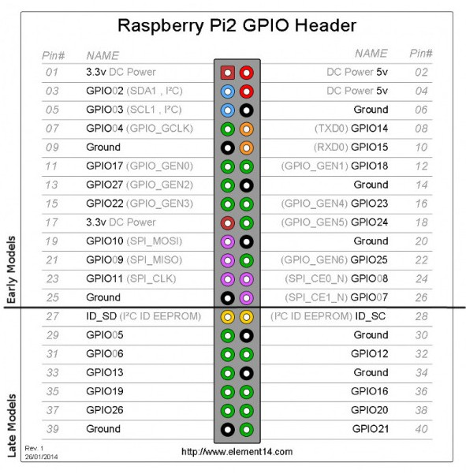

# slack-home-automation
> Using Slack for your home automation

Braai is a big part of South African culture and to make sure your rump steak is a perfect medium-rare you need a decent light to shine on the braai at will. It is also important to be able to control your light with a slack bot - off course!


## Setup


### Raspberry-Pi


Before you start with the slack bot make sure you have a Raspberry Pi setup, the [official documentation](https://www.raspberrypi.org/documentation/setup/) is an excellent way to start.





### 5V Relay


Use the Raspberry Pi GPIO Header diagram as guide and connect the following pins.

* Source 5V from R-Pi (pin 2) and connect to VCC on relay
* Connect ground from R-Pi (pin 6) and connec to to GND on relay
* Connect GPIO output pin from R-Pi (pin 18) and connect to CH1 on relay 
* Connect the voltage terminals (Make sure you have unplugged your light!!)
    - Neatly strip the wire casing
    - Cut the brown wire and strip the 2 ends
    - Connect one end to relay terminal marked NO (Normally Open)
    - Connect the other end to relay terminal marked C (Common Terminal)

### Install libraries needed

Follow the Full Stack Python guide - [How to Build Your First Slack Bot with Python](https://www.fullstackpython.com/blog/build-first-slack-bot-python.html)

Install Git on your Rasberry Pi by following the following steps in a terminal

```
sudo apt-get update
sudo apt-get install git
install git
```

Clone the project

```
git clone https://github.com/chasingbob/slack-home-automation.git
```

run print_bot_id.py the first time and save your 'bot_id' 

```
python3 print_bot_id.py
```

Create a config.json file and add the following to it:

```
{
    "token" : "your-token-here",
    "bot_name" : "your-bot-name",
    "bot_id" : "your-id"
}
```

### Switching your light on/off

Now you log into Slack with your phone/computer and literally ask your slack bot to switch your braai-light on by using the following command in your home-automation channel.

'''
@your-bot switch braai-light on
'''


## Release History

* 0.0.1 First check-in

## Get in touch

Pull requests are welcome or contact me.

Dries Cronje | [@dries139](twitter.com/dries139) | dries.cronje@outlook.com


